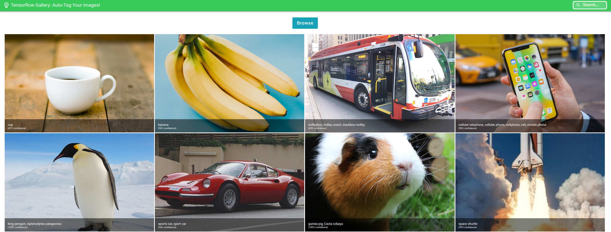
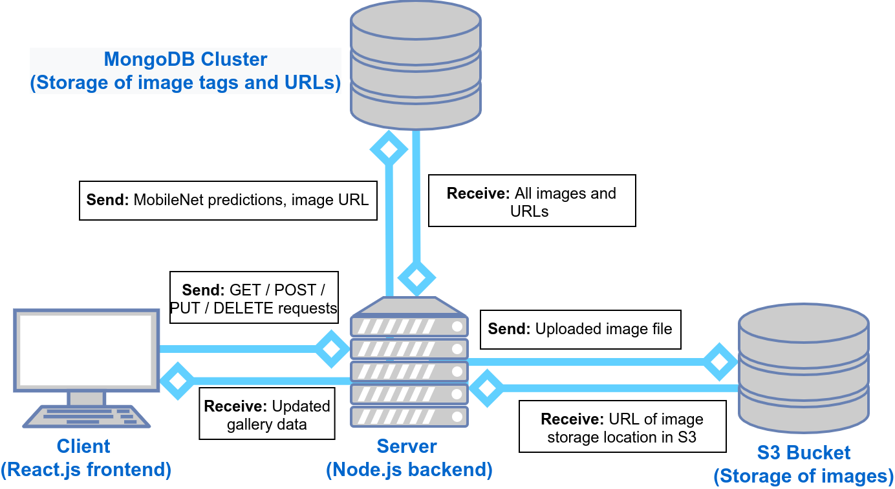

# Tensorflow Gallery |  Shopify Summer 2022 Challenge
[Deployed app link](https://still-tundra-89660.herokuapp.com/)
Tensorflow Gallery accurately identifies and tags images that you upload without any manual identification necessary, and allows you to search by image content!

# Technical Details

## Frontend
I built the client using **React.js** and styled it using **Material UI**. I made use of Material UI's GridList feature to display the gallery. I also added a search feature using partial string matches. 

## Backend
1. The server was created using **Node.js/Express.js**. I run **Tensorflow.js** on the server and use the pretrained MobileNet model. The model performs inference on each new image uploaded and generates a prediction with a confidence value, which becomes the image's tag. It should be noted that this 

2. After the image tag is obtained, I then upload the image to a **AWS S3 bucket**, using the Node library **multers3**. I chose to store the images on S3 as it is not recommended to store images on databases since they take up too much space. The S3 bucket returns a URL of the storage location of the image.

3. After obtaining the image URL from the AWS S3 bucket, I make an entry on the **MongoDB database**, which contains the filename, the predicted tag (and confidence), as well as the URL on S3. 

4. In order to show the gallery to the end user, the server fetches all of the entries from MongoDB and sends them to the client. The client renders all of the image links from the S3 bucket and shows the AI-generated tag. 
